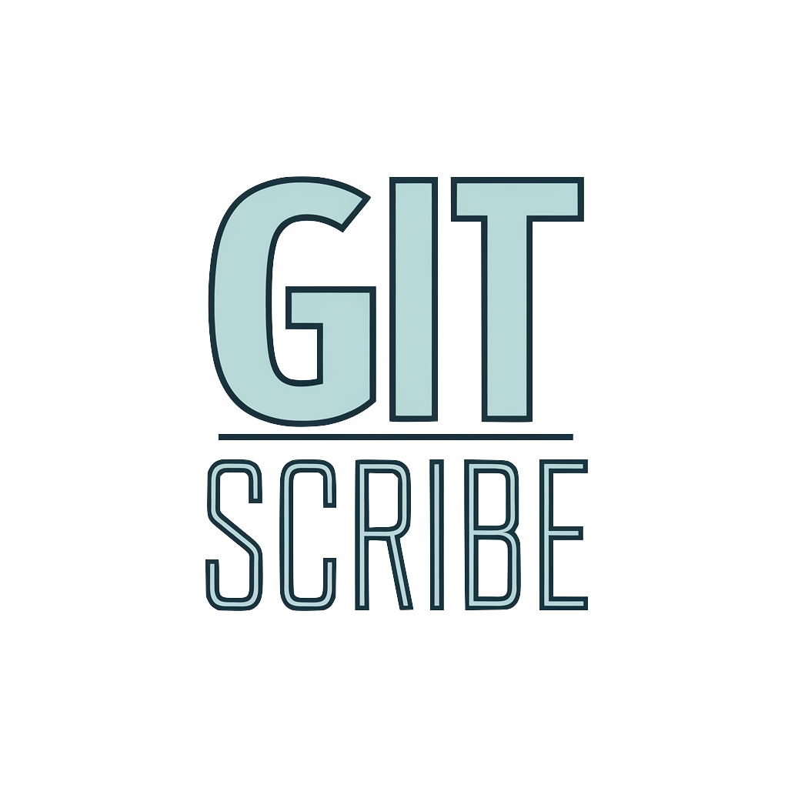
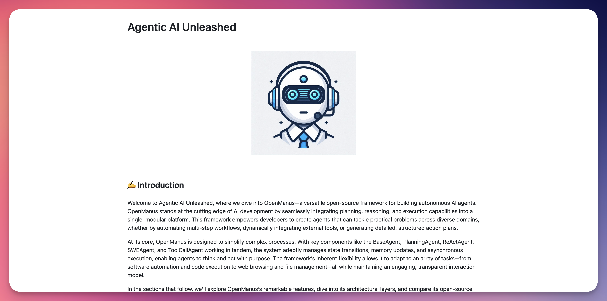
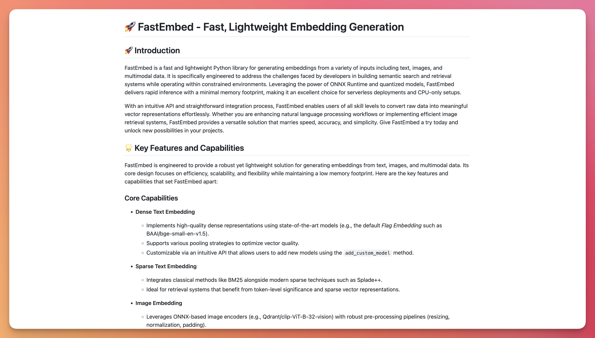
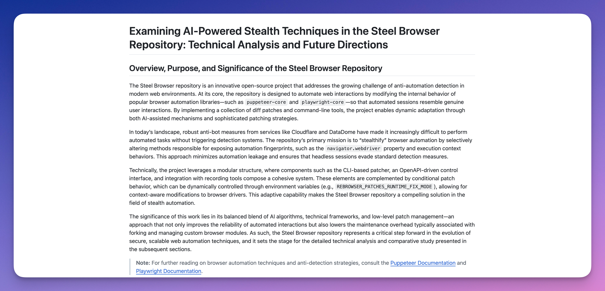
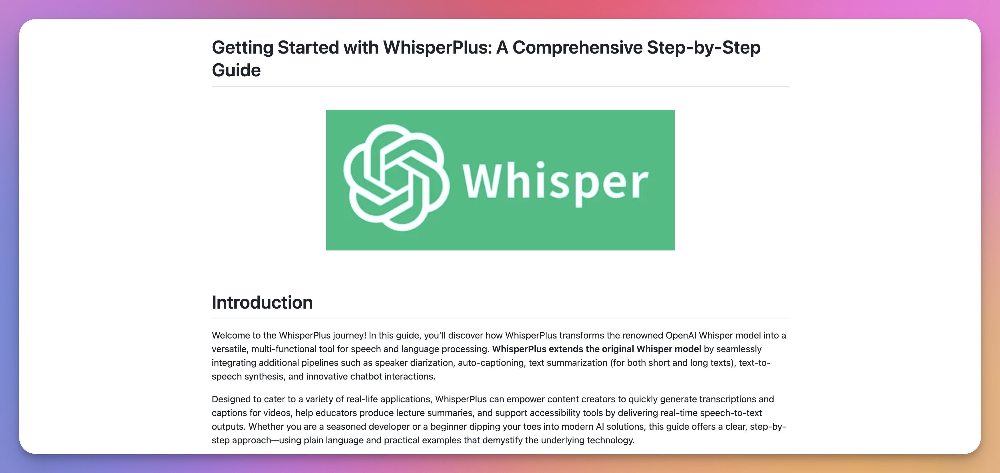
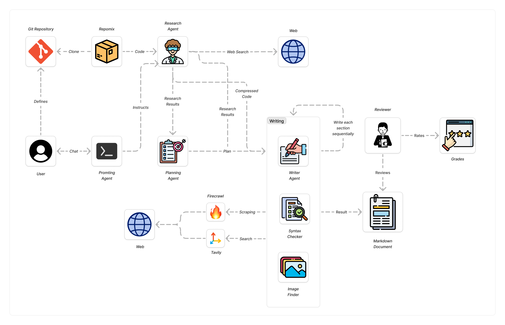
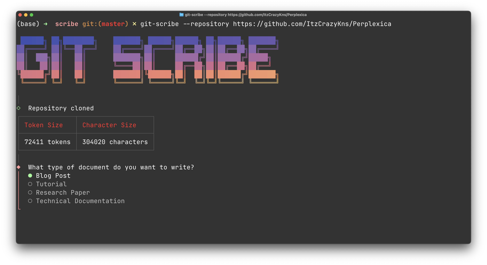

<br />
<p align="center">
  
  <br />
  <p align="center">Generate Blog Posts and Research papers from Git Repositories using a chain-of-agents.</p>
  <p align="center">
    <a href="https://github.com/codespaces/new/HQarroum/git-scribe">
      
    </a>
  </p>
</p>
<br />

## 🔖 Features

- 📰 **Article Generation** - Creates an article (blog, post, research paper, tutorial, or technical documentation) based on a Git repository.
- 📦 **Repository Analysis** - Analyzes a Git repository to extract relevant information and packages the code using [Repomix](https://github.com/yamadashy/repomix).
- 💁 **Integrate with Tools** - Uses a chain-of-agents to analyze the Git repository, scrape the web for additional information, and curate the article.
- 🔎 **Research Agent** - A research agent is used to create a research paper and a bibliography of the repository to ground the article generation.
- 📈 **Evaluations** - Provides an optional evaluation of the quality of the written document following different metrics.

## ✍️ Examples

Below are a few examples of documents generated with GitScribe, ranging from blog post, to technical `README.md` generations, to research papers.

<br />
<table>
  <tr align="center">
    <td>
      <a href="./examples/fastembed-technical-documentation.md">
        
      </a>
    </td>
    <td>
      <a href="./examples/fastembed-technical-documentation.md">
        
      </a>
    </td>
    <td>
      <a href="./examples/steelbrowser-research-paper.md">
        
      </a>
    </td>
    <td>
      <a href="./examples/whisperplus-tutorial.md">
        
      </a>
    </td>
  </tr>
  <tr>
    <td align="center">
      <a href="./examples/openmanus-blog-post.md">Blog Post on OpenManus</a>
    </td>
    <td align="center">
      <a href="./examples/fastembed-technical-documentation.md">README.md for FastEmbed</a>
    </td>
    <td align="center">
      <a href="./examples/steelbrowser-research-paper.md">Research Paper on SteelBrowser</a>
    </td>
    <td align="center">
      <a href="./examples/whisperplus-tutorial.md">Tutorial on WhisperPlus</a>
    </td>
  </tr>
</table>
<br />

## How it works ❓

Git Scribe implements a chain-of-agents to analyze a Git repository, issue research on the topics and techniques used in the code, and generate a Markdown file that can be either a blog post, a tutorial, a research paper, or a technical documentation. At a high-level the process looks as follows.

<p align="center">
  
</p>

## 🚀 Quickstart

### Using `npm`

```bash
npm install -g git-scribe-cli
```

### Environment

GitScribe depends on the [OpenAI API](https://platform.openai.com/docs/overview) for generating content and reasoning, the [Firecrawl API](https://www.firecrawl.dev/) (use free tier) for scraping websites, and [Tavily](https://tavily.com/) (use free tier) for web search. You must export their respective API keys before running GitScribe.

```bash
export OPENAI_API_KEY=<your-openai-api-key>
export FIRECRAWL_API_KEY=<your-firecrawl-api-key>
export TAVILY_API_KEY=<your-tavily-api-key>
```

### Usage

We'll start by generating a blog post based on the [Perplexica](https://github.com/ItzCrazyKns/Perplexica) project which is an open-source clone of Perplexity.

```bash
git-scribe \
  --repository https://github.com/ItzCrazyKns/Perplexica \
  --output ./perplexica-blog-post.md
```

You will then be prompted by an AI agent to provide information on how to write the blog post and what features you are interested to highlight about the project. 

<br />
<p align="center">
  
<br />

Below is an example prompt you can use.

> 💁 "I would like you to write a blog post on the Perplexica project, what features it brings, how it compares to the Perplexity AI-powered search engine, and how it can be used in a real-world scenario. Make it clear how to install and use the project. Make it informal, engaging, use emojis where you see fit."

The process of writing the blog post takes generally between 4 to 5 minutes. See an example result of this prompt [here](./examples/perplexica-blog-post.md).

## 📟 Options

- `-r` or `--repository` - The URL or local path of the Git repository to analyze.
- `-o` or `--output` - Path to the output file where to store the generated document (must be a Markdown file, and end with `.md`).
- `-p` or `--research-output` - Path to the output file where to store the intermediary generated research paper (for debugging purposes).
- `-e` or `--enable-reviewer` - Enable the reviewer agent to evaluate the quality of the generated document.
- `-h` or `--help` - Display the help message.

## 🚧 Limitations

- If the repository content exceeds 140k tokens, GitScribe will only process the first 140k tokens which may result in a loss of accuracy.
- This repository makes heavy use of the `o3-mini` model for its reasoning abilities and low cost, which at the time of writing, is behaving rather poorly with tool use on large context windows. This can result in the model not being able to conduct extended web search.

## 🤖 Models

This application uses the [Vercel AI SDK](https://sdk.vercel.ai/docs/introduction) and exposes the models it uses for each agent in the [`providers`](./src//providers.ts) file. You can change the models being used by modifying the model you want to use for each agent in the file and use another provider such as [OpenRouter](https://sdk.vercel.ai/providers/community-providers/openrouter), [Ollama](https://sdk.vercel.ai/providers/community-providers/ollama), or [Anthropic](https://sdk.vercel.ai/providers/ai-sdk-providers/anthropic).

## 👀 See Also

- [Repomix](https://github.com/yamadashy/repomix) - Packages content from a Git repository into a single prompt.
- [Firecrawl API](https://www.firecrawl.dev/) - A web scraping API optimized for LLMs.
- [Tavily](https://tavily.com/) - An API for finding relevant web pages or images for a given query.
