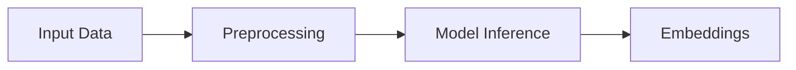
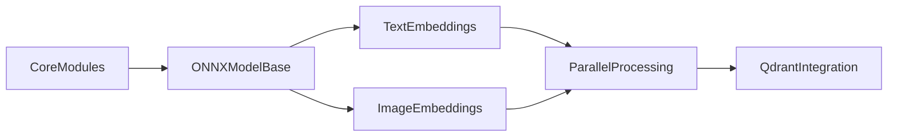
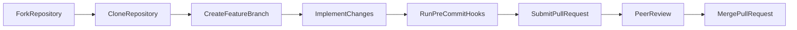

# 🚀 FastEmbed - Fast, Lightweight Embedding Generation

## 🚀 Introduction

FastEmbed is a fast and lightweight Python library for generating embeddings from a variety of inputs including text, images, and multimodal data. It is specifically engineered to address the challenges faced by developers in building semantic search and retrieval systems while operating within constrained environments. Leveraging the power of ONNX Runtime and quantized models, FastEmbed delivers rapid inference with a minimal memory footprint, making it an excellent choice for serverless deployments and CPU-only setups.

With an intuitive API and straightforward integration process, FastEmbed enables users of all skill levels to convert raw data into meaningful vector representations effortlessly. Whether you are enhancing natural language processing workflows or implementing efficient image retrieval systems, FastEmbed provides a versatile solution that marries speed, accuracy, and simplicity. Give FastEmbed a try today and unlock new possibilities in your projects.

## 🌟 Key Features and Capabilities

FastEmbed is engineered to provide a robust yet lightweight solution for generating embeddings from text, images, and multimodal data. Its core design focuses on efficiency, scalability, and flexibility while maintaining a low memory footprint. Here are the key features and capabilities that set FastEmbed apart:

### Core Capabilities

- **Dense Text Embedding**  
  - Implements high-quality dense representations using state-of-the-art models (e.g., the default *Flag Embedding* such as BAAI/bge‑small‑en‑v1.5).  
  - Supports various pooling strategies to optimize vector quality.  
  - Customizable via an intuitive API that allows users to add new models using the `add_custom_model` method.

- **Sparse Text Embedding**  
  - Integrates classical methods like BM25 alongside modern sparse techniques such as Splade++.  
  - Ideal for retrieval systems that benefit from token-level significance and sparse vector representations.

- **Image Embedding**  
  - Leverages ONNX‑based image encoders (e.g., Qdrant/clip‑ViT‑B‑32‑vision) with robust pre‑processing pipelines (resizing, normalization, padding).  
  - Ensures quick and accurate conversion of image data into dense vectors.

- **Late Interaction & Multimodal Integration**  
  - Enhances initial embeddings by adding interaction layers (e.g., ColBERT‑style models) to refine semantic matching.  
  - Supports scenarios where both text and image signals are combined for better retrieval outcomes.

- **Batch Processing and Parallel Execution**  
  - Optimized for processing large datasets in parallel using ONNX Runtime’s threading and custom multiprocessing utilities.  
  - This design minimizes memory usage while boosting throughput.

- **Qdrant Integration**  
  - Seamlessly integrates with the [Qdrant](https://qdrant.tech/) vector search engine for efficient indexing and semantic search.  
  - Simplifies the deployment of retrieval systems by combining fast embedding generation with robust vector management.

### Summary Table

| Feature                         | Description |
|---------------------------------|-------------|
| Dense Text Embedding            | Generates high-quality dense vectors with customizable pooling and supports custom model extensions. |
| Sparse Text Embedding           | Employs both traditional and modern sparse approaches for effective retrieval tasks. |
| Image Embedding                 | Uses ONNX‑based models with comprehensive pre‑processing pipelines for rapid image encoding. |
| Late Interaction & Multimodal   | Augments embeddings with additional interaction layers to combine modalities. |
| Batch & Parallel Processing     | Provides efficient, scalable inference with low memory overhead. |
| Qdrant Integration              | Enables straightforward semantic search integration with the Qdrant engine. |

### Custom Model Extension Example

Users can extend FastEmbed with their own models. For instance:

```python
from fastembed import TextEmbedding

TextEmbedding.add_custom_model(
    model="custom-model",
    pooling="CLS",
    normalization=True,
    sources={"hf": "custom-model-hf"},
    dim=768
)
```

Built on modern techniques—including quantized models and optimized ONNX operations—FastEmbed delivers fast, light, and flexible embedding generation for diverse applications. For further details on ONNX Runtime, visit [ONNX Runtime](https://onnxruntime.ai/).

## ⚙️ Installation

FastEmbed is designed to be simple to install and works seamlessly in a variety of environments. Choose the installation option that best suits your hardware setup:

### CPU-Only Installation

For environments that run on CPU only, install FastEmbed with:

```bash
pip install fastembed
```

### GPU-Enabled Installation

If you want to leverage GPU acceleration using ONNX Runtime, install the GPU version:

```bash
pip install fastembed-gpu
```

### Qdrant Integration

To integrate FastEmbed with the Qdrant vector search engine, use the following commands:

- For CPU-only setups:

  ```bash
  pip install qdrant-client[fastembed]
  ```

- For GPU-enabled setups:

  ```bash
  pip install qdrant-client[fastembed-gpu]
  ```

> ℹ️ **Note**: On shells like zsh, you might need to wrap the package specifier in quotes (e.g., `pip install 'qdrant-client[fastembed]'`).

With these simple commands, you’re all set to start generating fast, lightweight embeddings with FastEmbed!

## 💻 Usage Examples

Below are several self-contained examples demonstrating how to generate embeddings using FastEmbed across various modalities. These examples showcase the simple API for dense text embeddings, image embeddings, as well as sparse and late interaction models for advanced retrieval scenarios.

### Dense Text Embeddings

Generate dense embeddings from a list of documents using the default text model:

```python
from fastembed import TextEmbedding

# Sample documents
documents = [
    "FastEmbed is built for speed and low memory usage.",
    "It supports state-of-the-art models for semantic search."
]

# Initialize and run the dense text embedding model
model = TextEmbedding()  # Default model (e.g., Flag Embedding)
embeddings = list(model.embed(documents, batch_size=128))

# Output the shape of the first embedding to verify dimensions (e.g., 384 or 768)
print("First embedding shape:", embeddings[0].shape)
```

### Image Embeddings

Convert images into dense vector representations with an ONNX‑based image encoder:

```python
from fastembed import ImageEmbedding

# List of image file paths
images = ["./images/sample1.jpg", "./images/sample2.jpg"]

# Instantiate the image embedding model (using a supported model name)
image_model = ImageEmbedding(model_name="Qdrant/clip-ViT-B-32-vision")
image_embeddings = list(image_model.embed(images, batch_size=8))

# Display the shape of the embedding for the first image
print("Image embedding shape:", image_embeddings[0].shape)
```

### Sparse and Late Interaction Embeddings

FastEmbed also provides pipelines for sparse embedding generation as well as late interaction models for refining semantic matches.

#### Sparse Text Embeddings

Generate sparse representations that are useful in token-level retrieval contexts:

```python
from fastembed import SparseTextEmbedding

documents = [
    "This document demonstrates sparse embedding techniques.",
    "Sparse models can enhance information retrieval tasks."
]

sparse_model = SparseTextEmbedding()  # Default sparse model
sparse_embeddings = list(sparse_model.embed(documents))

# Print sparse embeddings (structure may vary based on the model's implementation)
print("Sparse embeddings:", sparse_embeddings)
```

#### Late Interaction Text Embeddings

Use a late interaction model to combine initial embeddings with additional interaction layers:

```python
from fastembed import LateInteractionTextEmbedding

queries = [
    "What is FastEmbed?",
    "Tell me about fast embedding generation."
]

late_model = LateInteractionTextEmbedding()  # Instantiates a late interaction model
late_embeddings = list(late_model.embed(queries))

# Verify the output by printing the shape of the first embedding
print("Late interaction embedding shape:", late_embeddings[0].shape)
```

> 📌 *Tip:* All models accept additional parameters such as `batch_size` and `parallel` to optimize processing. For more details and further customization, please refer to the [FastEmbed documentation](https://qdrant.github.io/fastembed/).

---

To visualize the embedding generation workflow, consider the following high-level diagram:



## 🔧 Configuration

FastEmbed offers a variety of configuration options that empower you to tailor the library’s behavior to your specific use case. Whether you're optimizing for performance with GPU acceleration or customizing your data preprocessing pipelines, these settings help you fine-tune model loading and inference.

### Key Configuration Options

| Option     | Type           | Default | Description                                                                                                                                     |
|------------|----------------|---------|-------------------------------------------------------------------------------------------------------------------------------------------------|
| `cache_dir`  | string         | None    | Specifies the local directory to cache downloaded model files. You can also set the `FASTEMBED_CACHE_PATH` environment variable.               |
| `providers`  | list[string]   | None    | Allows you to specify ONNX Runtime execution providers (e.g., `["CUDAExecutionProvider"]` for GPU support).                                       |
| `cuda`       | bool           | False   | Enables GPU inference when set to `True`; typically used alongside appropriate ONNX providers.                                                  |
| `device_ids` | list[int]      | None    | Defines which GPU devices to use if multiple GPUs are available.                                                                                |
| `lazy_load`  | bool           | False   | Defers model loading until the first embedding call, reducing startup time in resource-constrained environments.                                 |

### Example Usage

Below is an example of configuring a text embedding model with a custom cache directory and GPU acceleration:

```python
from fastembed import TextEmbedding

# Initialize the model with custom configuration
model = TextEmbedding(
    cache_dir="/path/to/custom/cache",
    providers=["CUDAExecutionProvider"],
    cuda=True,
    device_ids=[0]
)

# Generate embeddings as usual
documents = ["Customize FastEmbed configuration for optimal performance."]
embeddings = list(model.embed(documents))
print("Embedding dimensions:", embeddings[0].shape)
```

> ℹ️ **Tip:** Advanced users who need to adjust the default preprocessing pipelines (e.g., tokenization, image resizing, normalization) can subclass the core embedding classes and override their `_preprocess` methods. For more details, see our [FastEmbed Documentation](https://qdrant.github.io/fastembed/).

## 🛠 Architecture Overview

FastEmbed is built with a modular and layered architecture that underpins its fast and lightweight embedding generation. This design clearly separates concerns, making the system both extensible and easy to maintain. Key components include:

- **Core Common Modules:**  
  These modules handle model metadata, management, and ONNX model handling. Files in the fastembed/common directory define immutable model descriptions, manage downloads and caching, and wrap ONNX model loading with preprocessing and postprocessing utilities. This uniform interface ensures consistency across different embedding modalities.

- **Domain-Specific Packages:**  
  FastEmbed splits functionality based on data types:  
  • The **Text Embedding Module** (fastembed/text) implements dense, sparse, and late‐interaction embeddings using diverse pooling strategies and supports custom model extensions.  
  • The **Image Embedding Module** (fastembed/image) provides ONNX‑based image encoders with tailored pre‑processing (resizing, normalization, etc.) for efficient image interpretation.

- **Parallel Processing:**  
  A dedicated module (fastembed/parallel_processor.py) leverages Python’s multiprocessing to enable data‑parallel encoding. This optimizes batch processing while minimizing memory overhead on multicore systems.

- **Qdrant Integration:**  
  Seamlessly integrated, FastEmbed provides interfaces for interacting with Qdrant, allowing developers to connect embedding generation with scalable semantic search solutions.

Below is a high‑level diagram illustrating the core interactions:



This structured design, along with clearly defined interfaces, empowers developers to extend or customize components easily while maintaining high performance across environments. For further details, see the [ONNX Runtime documentation](https://onnxruntime.ai/) and [Qdrant](https://qdrant.tech/).

## 🤝 Contributing

We welcome contributions to FastEmbed! Whether you’re fixing a bug, improving documentation, or adding new features, your help makes our project stronger. Our community-driven approach is key to fast, lightweight, and reliable embedding generation, and we encourage developers of all experience levels to join in.

For detailed guidelines on how to contribute, please review our [CONTRIBUTING.md](./CONTRIBUTING.md) file. For insights on versioning and our release process, see our [RELEASE.md](./RELEASE.md) file.

Before submitting changes, ensure your work adheres to our coding standards. We enforce quality through pre-commit hooks and use tools like `ruff` for linting. To get started, install the hooks locally:

```bash
pre-commit install
```

If you’re new, check out issues labeled “good first issue” to familiarize yourself with our workflow. Once you’re ready, fork the repository, create a feature branch, and submit a pull request for review. Every contribution is valued and helps drive FastEmbed’s continuous improvement!

Below is a simplified view of our contribution process:



## 📚 Further Reading and Bibliography

For users who wish to delve deeper into the technologies and ecosystem underpinning FastEmbed, the resources listed below provide comprehensive guides, official documentation, and community support. These links cover everything from vector search engines and optimized inference with ONNX Runtime to packaging tools and advanced tokenization. Exploring these resources will enhance your understanding of both FastEmbed and the broader landscape of modern embedding techniques.

| Resource                          | Description                                                                                                                                          | Link                                                         |
|-----------------------------------|------------------------------------------------------------------------------------------------------------------------------------------------------|--------------------------------------------------------------|
| **Qdrant Official Site**          | Learn about Qdrant, the vector search engine that FastEmbed integrates with for efficient semantic search and retrieval tasks.                         | [qdrant.tech](https://qdrant.tech/)                            |
| **FastEmbed Documentation and Examples** | Official documentation with detailed usage examples, model overviews, and integration tips to help you get the most out of FastEmbed.            | [fastembed docs](https://qdrant.github.io/fastembed/)          |
| **FastEmbed GitHub Repository**   | Browse the source code, track issues, and review contribution guidelines to understand FastEmbed’s design and community standards.                   | [GitHub Repo](https://github.com/qdrant/fastembed)             |
| **ONNX Runtime Documentation**    | Discover how ONNX Runtime accelerates model inference, offering optimizations for both CPU and GPU environments critical for fast embedding generation. | [onnxruntime.ai](https://onnxruntime.ai/)                      |
| **HuggingFace Hub**               | Explore a vast collection of pretrained models and datasets that inspire FastEmbed’s supported models and embedding techniques.                       | [HuggingFace](https://huggingface.co/)                         |
| **Poetry – Python Packaging**     | Get started with Poetry, the dependency and packaging manager used by FastEmbed, and learn how to manage your project's dependencies effectively.    | [Poetry Docs](https://python-poetry.org/docs/)                 |
| **mkdocs-material**               | A modern, responsive theme for MkDocs that powers FastEmbed’s documentation website—ideal for creating visually appealing and user-friendly docs.     | [mkdocs-material](https://squidfunk.github.io/mkdocs-material/)  |
| **Python Multiprocessing Documentation** | Understand the built-in parallel processing capabilities in Python, which FastEmbed leverages to boost performance when processing large datasets.   | [Multiprocessing Docs](https://docs.python.org/3/library/multiprocessing.html) |
| **HuggingFace Tokenizers**        | Learn about the efficient tokenization techniques used in FastEmbed’s preprocessing pipelines, crucial for preparing text data for embedding generation.  | [Tokenizers](https://huggingface.co/docs/tokenizers/)            |

> ℹ️ **Note:** These resources not only complement the FastEmbed documentation but also offer broader insights into the technologies that power modern embedding and retrieval systems. Whether you’re troubleshooting, optimizing performance, or seeking inspiration for customizations, this bibliography serves as a valuable guide to deepen your expertise.

## 📄 License

FastEmbed is distributed under the [Apache License 2.0](https://www.apache.org/licenses/LICENSE-2.0), a permissive open-source license that grants you the freedom to use, modify, and distribute the software in both personal and commercial projects. Redistribution of FastEmbed or any derivative works must include the original copyright notice and this license text. The license also provides an express patent grant, offering protection for both users and contributors. By using or contributing to FastEmbed, you agree to adhere to the terms and conditions of the Apache License 2.0, ensuring proper attribution and compliance in all modified versions.