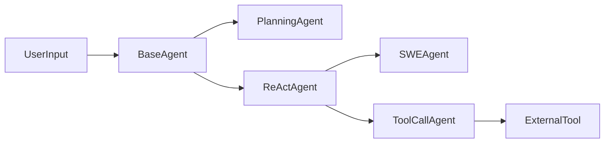
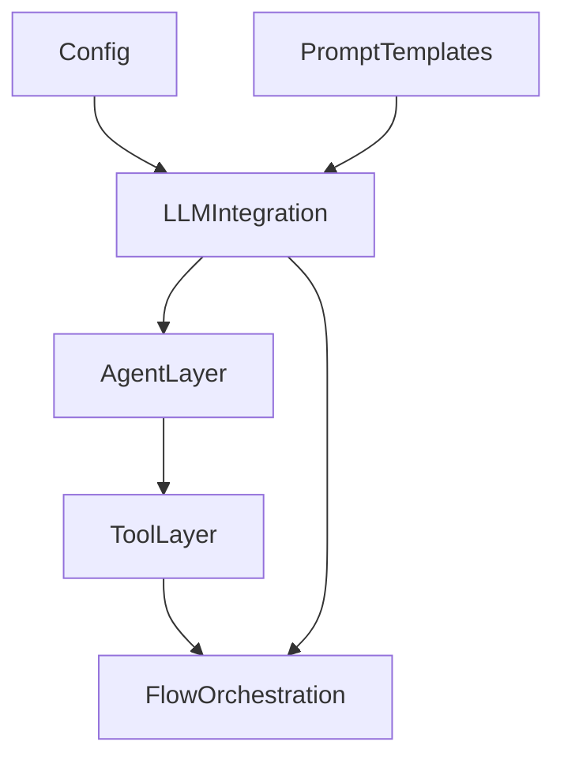

# Agentic AI Unleashed

<br />
<p align="center">
  
</p>
<br />

## ✍️ Introduction

Welcome to Agentic AI Unleashed, where we dive into OpenManus—a versatile open‑source framework for building autonomous AI agents. OpenManus stands at the cutting edge of AI development by seamlessly integrating planning, reasoning, and execution capabilities into a single, modular platform. This framework empowers developers to create agents that can tackle practical problems across diverse domains, whether by automating multi‑step workflows, dynamically integrating external tools, or generating detailed, structured action plans.

At its core, OpenManus is designed to simplify complex processes. With key components like the BaseAgent, PlanningAgent, ReActAgent, SWEAgent, and ToolCallAgent working in tandem, the system adeptly manages state transitions, memory updates, and asynchronous execution, enabling agents to think and act with purpose. The framework’s inherent flexibility allows it to adapt to an array of tasks—from software automation and code execution to web browsing and file management—all while maintaining an engaging, transparent interaction model.

In the sections that follow, we’ll explore OpenManus’s remarkable features, dive into its architectural layers, and compare its open‑source model with commercial solutions. Join us on this journey as we uncover how OpenManus is reshaping the future of autonomous AI agents.

## 🔖 Features

OpenManus is a highly modular framework that offers a rich set of functionalities to build autonomous, multi‑capable agents. Its design centers around a collection of specialized agent modules—each tailored to address unique aspects of problem solving—and a versatile toolkit of external integrations. These features empower developers to create solutions for complex tasks such as task automation, multi‑step decision making, and seamless tool integration.

### Agent Modules Breakdown

At the heart of OpenManus are its core agent modules:

| Agent Module     | Description                                                                                                                                              | Example Use Case                                      |
| ---------------- | -------------------------------------------------------------------------------------------------------------------------------------------------------- | ----------------------------------------------------- |
| **BaseAgent**    | The foundational class handling state management, memory updates, and asynchronous step execution, forming the backbone for all other agents.           | Underpins all autonomous workflows.                 |
| **PlanningAgent**| Focused on breaking down tasks into structured, actionable plans. It dynamically creates and tracks progress through multi‑step workflows.                | Crafting a detailed travel itinerary for a trip.      |
| **ReActAgent**   | Implements a clear separation between the "thinking" phase and the subsequent "action" with distinct `think` and `act` methods, improving clarity in decision making. | Deciding which tool to use based on iterative reasoning.  |
| **SWEAgent**     | Specially designed for autonomous programming tasks. It interacts with system resources (e.g., executing bash commands or managing file operations) to solve coding challenges. | Automating code debugging or script generation.       |
| **ToolCallAgent**| Extends the reactive agents by dynamically invoking external tools like Python execution, web browsing, and file management with robust error handling. | Running multi‑step workflows that require diverse tool support. |

### Tool Integration and Real‑World Scenarios

OpenManus isn’t just about agent logic—the framework integrates a variety of tools that expand an agent’s capabilities:

- **PythonExecute:** Run custom Python code in a safe, isolated environment.
- **BrowserUseTool:** Automate web browsing tasks such as navigation and data extraction.
- **FileSaver:** Save and manage output files (e.g., text, HTML, code) to persist results.
- **GoogleSearch:** Retrieve real-time information from the web to inform decisions.
- **Terminate:** Signal the end of an interaction or workflow, ensuring clean termination.

Consider a scenario where a PlanningAgent is tasked with creating a week‑long travel itinerary. The agent first breaks the request into actionable steps and then coordinates with the ToolCallAgent to:
- Use **GoogleSearch** for up‑to‑date travel insights,
- Leverage **PythonExecute** for processing itinerary data,
- And apply **FileSaver** to store and format the final travel plan.

In another example, a SWEAgent might automatically set up and debug a new project by executing system commands through **Bash**, editing configurations with specialized editors, and finalizing the process by calling **Terminate** when the task is complete.

### How the Components Interact

The design of OpenManus clearly delineates responsibilities among agents while allowing them to interact seamlessly with external tools. The following Mermaid diagram illustrates a simplified flow of interaction between key components:



### Flexibility Through Open‑Source Innovation

One of the outstanding advantages of OpenManus is its open‑source nature. Developers have full access to the source code and can tailor the agent modules and tool integrations to suit a wide array of use cases. Whether you’re automating mundane tasks or building sophisticated multi‑step decision makers, the modular architecture of OpenManus lets you experiment, extend, and customize every aspect of the system.

For more details, check out the [OpenManus GitHub repository](https://github.com/mannaandpoem/OpenManus) along with resources such as the [Pydantic Documentation](https://docs.pydantic.dev/latest/), [FastAPI](https://fastapi.tiangolo.com/), and [Loguru](https://loguru.readthedocs.io/en/stable/).

### Quick Start Code Example

Below is a brief Python snippet demonstrating the use of a PlanningAgent to create a travel itinerary:

```python
from app.agent.planning import PlanningAgent
from app.tool import ToolCollection, PlanningTool, Terminate
import asyncio

async def main():
    agent = PlanningAgent(available_tools=ToolCollection(PlanningTool(), Terminate()))
    result = await agent.run("Plan a detailed itinerary for a week-long trip to Japan.")
    print(result)

if __name__ == "__main__":
    asyncio.run(main())
```

### Next Steps

- [ ] Experiment with different agent modules in your projects.
- [ ] Customize prompt templates to fit specialized tasks.
- [ ] Integrate additional tools to expand the functional landscape of your agents.

OpenManus’s rich feature set and modular design pave the way for innovative, autonomous solutions, empowering both new and experienced developers to tackle complex problems with confidence.

## ✏️ Architecture

OpenManus’s architecture is the powerhouse that enables its dynamic, autonomous capabilities. Built with modularity in mind, the framework is organized into three principal layers that work together seamlessly: the **Agent Layer**, the **Tool Layer**, and the **Flow Orchestration Layer**. In addition, robust LLM integration and flexible configuration via prompt templates guarantee that agents behave intelligently under a wide array of conditions.

### Agent Layer

The Agent Layer is the heartbeat of OpenManus. It encompasses several specialized agents—including `BaseAgent`, `PlanningAgent`, `ReActAgent`, `SWEAgent`, and `ToolCallAgent`—each designed to handle distinct tasks and operational modes. This layer manages critical operations such as state transitions, asynchronous step execution, and memory management. Leveraging data validation with Pydantic, every agent ensures that the internal state (e.g., running, finished, or error) is accurately maintained. Additionally, mechanisms like duplicate-response detection help agents adapt and avoid being stuck in repetitive loops.

### Tool Layer

The Tool Layer integrates a diverse set of asynchronous tools under a unified interface. Tools like `PythonExecute`, `BrowserUseTool`, `FileSaver`, and `GoogleSearch` are implemented to work seamlessly with agents, allowing them to execute external commands, interact with webpages, process data, and more. Each tool is designed with a JSON schema for parameter validation, ensuring that interactions remain consistent and safe even during complex, multi-step operations.

### Flow Orchestration Layer

To handle multi-step tasks, the Flow Orchestration Layer coordinates agent interactions and tool invocations. With components like the FlowFactory and PlanningFlow, the system can dynamically schedule and track progress across a sequence of actions. This orchestration not only promotes clear separation between reasoning and acting—but also provides the scalability needed for solving intricate workflows efficiently.

### LLM Integration and Configuration

Underpinning all layers is a centralized LLM interface that connects agents with large language models. By coupling prompt templates (crafted to deliver clear system and next-step instructions) with configuration modules that load settings from TOML files, OpenManus ensures uniform behavior. This alignment allows agents to dynamically generate responses that satisfy both user expectations and task-specific requirements.

Below is a simplified visualization of the architecture:



Overall, this layered design empowers OpenManus with the flexibility, robustness, and modularity required to tackle complex, real-world AI challenges.

## 🆚 Comparison

When it comes to choosing the right framework for autonomous AI agents, the decision often boils down to the trade-offs between open‑source flexibility and commercial turnkey solutions. In this context, OpenManus and Manus AI represent two distinct approaches: one driven by community innovation and transparency, and the other by a controlled, proprietary design.

One of the most striking differences lies in their overall functionality. **OpenManus** is built with modularity in mind. Its rich agent ecosystem—comprising modules like `BaseAgent`, `PlanningAgent`, `ReActAgent`, `SWEAgent`, and `ToolCallAgent`—works in tandem with a variety of external tools such as Python execution, web browsing, and file management. This design empowers developers to easily experiment with multi‑step workflows, integrate new functionalities, and tailor the framework to unique problem domains. On the other hand, **Manus AI** offers a closed‑source, commercial application with fixed behaviors. Although it presents a streamlined solution for enterprise users, its proprietary nature limits customization and restricts transparency in how decisions are made.

The contrast in accessibility further underscores the differences. OpenManus is completely open‑source, providing full access to its source code, detailed prompt templates, and configuration files. This transparency not only enhances trust but also fosters a vibrant community where improvements are continuously shared. In contrast, Manus AI’s closed‑source model means that users are dependent on vendor updates and must work within the confines of predefined functionalities.

Below is a comparative summary highlighting key distinctions:

| Aspect         | OpenManus                                                                 | Manus AI                                                         |
| -------------- | ------------------------------------------------------------------------- | ---------------------------------------------------------------- |
| Functionality  | Modular agents, diverse tool integrations, customizable workflows         | Fixed workflows, limited tool integration, proprietary approach  |
| Accessibility  | Open‑source, full code access, community‑driven innovation                 | Commercial, closed‑source, vendor‑controlled modifications         |
| Innovation     | High potential for experimental extensions and bespoke solutions            | Streamlined for immediate deployment but less adaptable            |

In summary, while Manus AI may suit organizations looking for a ready‑to‑use solution, OpenManus offers unparalleled flexibility and the freedom to innovate. Developers and researchers who value transparency, ease of modification, and the ability to integrate or extend with new tools will find that OpenManus provides a fertile ground for transforming how autonomous AI systems are developed and deployed. For those interested in exploring further, check out the [OpenManus GitHub repository](https://github.com/mannaandpoem/OpenManus) and related resources from the [Pydantic Documentation](https://docs.pydantic.dev/latest/) and [FastAPI](https://fastapi.tiangolo.com/).

## 🏁 Conclusion

In conclusion, OpenManus is a dynamic open‑source framework that revolutionizes the way autonomous AI agents are built and deployed. Through its rich palette of agent modules, advanced tool integrations, and robust planning capabilities, the framework delivers a powerful blend of reasoning, planning, and execution that can tackle real‑world challenges effectively.

By leveraging a modular architecture, OpenManus not only simplifies complex workflows but also sparks innovation across diverse use cases. Its flexibility empowers developers to tailor each component—from the foundational BaseAgent to specialized tool‑call functionalities—to fit the unique demands of their projects.

Key benefits include:
- **Rich feature set** enabling efficient, multi‑step problem solving  
- **Scalable architecture** that adapts to varied domains  
- **Agentic capabilities** that foster adaptive decision-making  

Ultimately, OpenManus provides not just a toolset, but a paradigm shift for AI‑driven automation. We invite you to dive into the framework, experiment with its components, and join a vibrant community committed to shaping the future of autonomous AI solutions.

## 👀 See Also

For further exploration and insights into autonomous AI agents and related technologies, here are some valuable resources to check out:

- [MetaGPT on GitHub](https://github.com/geekan/MetaGPT)  
  *Discover how another innovative framework approaches autonomous agent design.*

- [OpenHands Project](https://github.com/All-Hands-AI/OpenHands)  
  *Explore collaborative projects that expand on agent-based applications.*

- [Pydantic Documentation](https://docs.pydantic.dev/latest/)  
  *Dive into robust data validation and model management with Pydantic.*

- [FastAPI Documentation](https://fastapi.tiangolo.com/)  
  *Learn how to build asynchronous web APIs that can power intelligent systems.*

- [OpenAI API Documentation](https://platform.openai.com/docs/api-reference)  
  *Gain deeper insights into LLM integrations and API functionalities.*