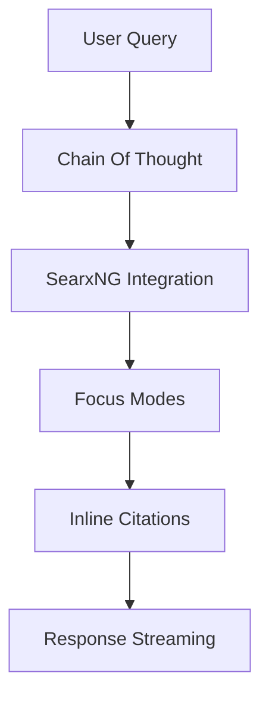
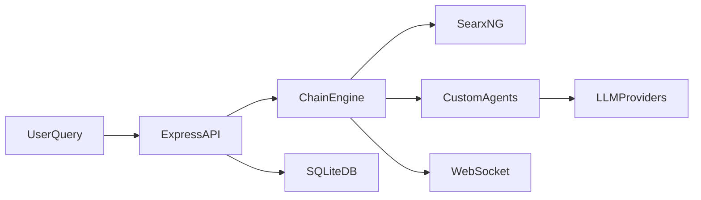

# Perplexica Unleashed 🚀

<br />
<p align="center">

</p>
<br />

# Introduction ✨

Hey tech enthusiasts and developers! Welcome to our deep dive into **Perplexica**, an open-source, AI-powered search and chat engine that’s here to shake up how we find and interact with information online. 🚀 In this post, we’re exploring how Perplexica leverages cutting-edge LLMs, dynamic web search via SearxNG, and a flexible multi-mode approach to deliver real-time, context-rich answers complete with inline citations.

We’ll compare Perplexica with its proprietary counterpart Perplexity, highlight its unique features, and walk you through a step-by-step installation guide—whether you’re using Docker or setting it up manually. Plus, get ready to see some awesome real-world use cases that make this tool a must-try. So, let’s dive in, have some fun, and unlock the true power of Perplexica! 😊

## Unique Edge 🔥

What really sets **Perplexica** apart from tools like Perplexity is its fresh, open‑source approach to AI-powered search. Instead of relying on a one-size-fits-all mechanism, Perplexica harnesses multiple large language models (LLMs) and leverages advanced chain-of-thought techniques to break down your queries into smarter, more intuitive steps. This way, it not only fetches live data from the web through SearxNG but does so while providing inline citations—ensuring full transparency and verifiability. 😎

Here’s why Perplexica is a game changer:

- **Innovative LLM Utilization:** It integrates different LLM providers, allowing for adaptable responses depending on your specific query.
- **Chain-of-Thought Processing:** By rephrasing follow-up questions into standalone queries, the engine streamlines complex interactions and ensures you get context-rich answers.
- **Real-Time Search Integration:** The seamless WebSocket streaming of data means you see your results as they’re generated—no waiting around!
- **Multi-Mode Flexibility:** Whether you need a quick general web search, scholarly material via academic mode, creative boosts from the writing assistant, or data crunching in Wolfram Alpha mode, Perplexica adapts to your needs. It even supports multimedia searches (like YouTube and Reddit) for when visuals or community insights are what you need.

Below is a quick overview of the focus modes:

| Focus Mode         | What It Does                                |
|--------------------|---------------------------------------------|
| webSearch          | General web exploration for any query       |
| academicSearch     | Digs up scholarly articles and research     |
| writingAssistant   | A creative guide for writing assistance     |
| wolframAlphaSearch | Tackles computation and data analysis tasks   |
| multimediaSearch   | Fetches videos and community discussions      |

This blend of cutting-edge techniques and user-focused design makes Perplexica a versatile, transparent, and downright fun tool to explore. Ready to experience the future of searching? 🚀



# Installation Guide

In this section, we’ll walk you through getting **Perplexica** up and running on your system. Whether you’re a Docker devotee or prefer a manual setup, follow our step-by-step instructions for a smooth installation experience.

---

## Using Docker (Recommended)

Docker streamlines the deployment by containerizing all required components—SearxNG, the backend, and the frontend. Here’s how:

- **Step 1: Rename the Configuration File**  
  Locate the `sample.config.toml` file in the project root and rename it to `config.toml`. This file stores critical settings like the server port and your API keys.

  ```bash
  mv sample.config.toml config.toml
  ```

- **Step 2: Launch with Docker Compose**  
  Make sure [Docker is installed](https://docs.docker.com/get-docker/). Then, in your terminal at the project directory, run:

  ```bash
  docker compose up -d
  ```

  > 🚀 **Tip:** Once the containers are running, Perplexica is accessible at [http://localhost:3000](http://localhost:3000).

- **Step 3: Manage Your Containers**  
  You can check the running containers with:
  
  ```bash
  docker ps
  ```
  
  And when it’s time to update or rebuild, execute:
  
  ```bash
  docker compose down --rmi all && docker compose up -d --build
  ```

---

## Manual Installation

For those who like more control or wish to customize individual components, follow these steps:

### Backend Setup

1. **Clone the Repository**

   ```bash
   git clone https://github.com/ItzCrazyKns/Perplexica.git
   cd Perplexica
   ```

2. **Rename the Configuration File**  
   Rename the `sample.config.toml` to `config.toml` and update it with your API keys and preferred settings.

3. **Install Dependencies & Run**

   - For development mode:

     ```bash
     npm install
     npm run dev
     ```

   - For production mode (after building):

     ```bash
     npm run build && npm run start
     ```

### Frontend Setup

1. **Navigate to the UI Directory**

   ```bash
   cd ui
   ```

2. **Prepare the Environment File**  
   Rename `.env.example` to `.env` and fill in any needed environment variables.

3. **Install Dependencies & Start the Frontend**

   - For development mode:

     ```bash
     npm install
     npm run dev
     ```

   - For production mode (after building):

     ```bash
     npm run build && npm run start
     ```

> 🔧 **Note:** The manual installation gives you full control over both the backend and frontend setups. If you need guidance on updates or advanced configuration, check out the [UPDATING.md](https://github.com/ItzCrazyKns/Perplexica/blob/master/docs/installation/UPDATING.md) file in the repository.

With these clear steps, even newcomers can set up Perplexica with ease. Happy coding and enjoy unleashing the power of this innovative search engine!

## Real-World Use

Perplexica isn’t just another search tool—it’s a real game changer when it comes to solving everyday challenges and powering up specialized projects. Whether you're a student on a research spree, a writer battling writer’s block, or a developer hunting for that perfect image or video to complement your presentation, Perplexica’s diverse capabilities have got your back! 😎

### Academic Research & Writing Assistance

Imagine diving into a research paper without the hassle of sifting through outdated information. With Perplexica’s `academicSearch` mode, you get access to the latest scholarly articles complete with inline citations for ultimate transparency. Scholars and students can now effortlessly verify sources and build well-supported arguments. Meanwhile, creative writers and bloggers will love the `writingAssistant` mode, which offers dynamic brainstorming and real-time feedback to polish your drafts and spark fresh ideas.

### Multimedia & Computational Queries

Need visual inspiration? Perplexica’s dedicated agents for image and video search fetch high-quality media that can transform your presentations or content projects. 🎥🖼️ And if you're tackling complex data or computation challenges, switch to the `wolframAlphaSearch` mode to get precise results on the fly. This makes it an ideal companion for courses, data analysis projects, or even quick calculations during your daily tasks.

| Use Case               | Description                                                          |
|------------------------|----------------------------------------------------------------------|
| Academic Research      | Access up-to-date scholarly resources with verified citations        |
| Writing Assistance     | Overcome creative blocks and enhance your writing with smart prompts  |
| Multimedia Search      | Retrieve high-quality images and videos to enrich your projects        |
| Computational Queries  | Tackle numbers and data with real-time, AI-powered computation          |

From classroom assignments to boardroom presentations, Perplexica’s real-time responses, source clarity, and versatile focus modes empower you to explore, learn, and innovate with confidence. Why not integrate it into your next project and experience a smarter way to search? 🚀

# Tech Breakdown

Perplexica’s robust architecture is a masterclass in modern, modular design that combines reliability, scalability, and real-time performance. Let’s pull back the curtain and explore the fascinating tech stack and inner workings powering this AI‐powered search engine!

## Backend Stack

- **Language & Runtime:** Built with Node.js and TypeScript, Perplexica benefits from type safety and up-to-date JavaScript features. Check out [Node.js](https://nodejs.org/) and [TypeScript](https://www.typescriptlang.org/) for more insights.
- **Framework:** It uses [Express](https://expressjs.com/) to manage HTTP routing and middleware, keeping the API clean and efficient.
- **Database:** Conversations and logs are stored in a SQLite database managed via [drizzle-ORM](https://orm.drizzle.team/). The schema (located in `src/db/schema.ts`) captures all the chat interactions.
- **Real-Time Communication:** With the power of the `ws` library, WebSockets stream responses instantly to the client—imagine getting your answer one character at a time!

## Chain-based Query Processing

At its core, Perplexica leverages a chain-of-thought approach built on the Langchain framework. Here’s what happens under the hood:

- **Custom Agents and Chains:** 
  - **MetaSearchAgent:** This chain pre-processes queries and determines when to fetch additional sources.
  - **Image & Video Search Agents:** They convert chat history into tailored queries for multimedia search.
- **LLM Integration:** Multiple providers—such as OpenAI, Anthropic, Gemini, Groq, and Ollama—are integrated seamlessly, allowing the engine to pick the best response model for each query. A dedicated module even re-ranks search results using similarity search algorithms (e.g., cosine similarity via `computeSimilarity.ts`), ensuring the most relevant sources are cited inline.

## Real-Time Streaming & Persistence

- **Streaming:** As soon as the chain processes a query, results are streamed via WebSocket (see code snippet below) to deliver a dynamic, real-time chat experience.
- **Data Persistence:** Every interaction is logged to SQLite, making it simple to retrieve chat history or troubleshoot issues.

Below is a simplified diagram of the overall architecture:



And here’s a quick code example for the WebSocket streaming setup:

```typescript
import { WebSocketServer } from 'ws';
const wss = new WebSocketServer({ port: 3001 });
wss.on('connection', socket => {
  socket.on('message', message => console.log('Received:', message));
});
```

This detailed tech breakdown shows how Perplexica seamlessly combines modern frameworks, real-time streaming, and chain-based query processing to deliver precise, contextual, and transparent answers. Explore more in the [official repository](https://github.com/ItzCrazyKns/Perplexica)!

# Conclusion 🎉

In summary, **Perplexica** emerges as a true game changer in the open-source AI landscape. By harmonizing advanced large language models, real-time search integration through SearxNG, and innovative chain-of-thought processing, it delivers answers that are not only fresh and context-rich but also fully transparent with inline citations. Whether you’re a researcher hunting for the latest academic insights, a creative writer seeking inspiration, or a developer looking to integrate cutting-edge search capabilities into your projects, Perplexica has something to offer.

We invite you to dive in and explore:
- Experiment with its diverse focus modes
- Customize the installation to suit your environment
- Contribute to and engage with our vibrant community

> 🚀 **Join the revolution in AI-powered search!** Check out the [Perplexica GitHub repository](https://github.com/ItzCrazyKns/Perplexica), share your feedback, and help shape the future of transparent, community-driven search technology. Happy exploring!

## See Also

For more insights into the technologies that power Perplexica, check out these related resources:

- **[Perplexity AI](https://www.perplexity.ai/)**  
  Explore the commercial counterpart and see how it compares to our open‑source journey with Perplexica.

- **[Langchain Documentation](https://python.langchain.com/)**  
  Dive into the chain-of-thought techniques that inspire Perplexica’s smart query processing.

- **[Next.js Documentation](https://nextjs.org/docs)**  
  Learn how this powerful React framework is used to build dynamic and responsive user interfaces.

- **[Docker Compose Docs](https://docs.docker.com/compose/)**  
  Master container orchestration and simplify deployment like we did with Perplexica.

Happy exploring! 🚀