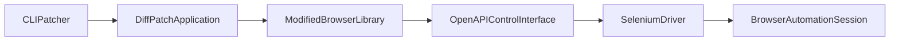
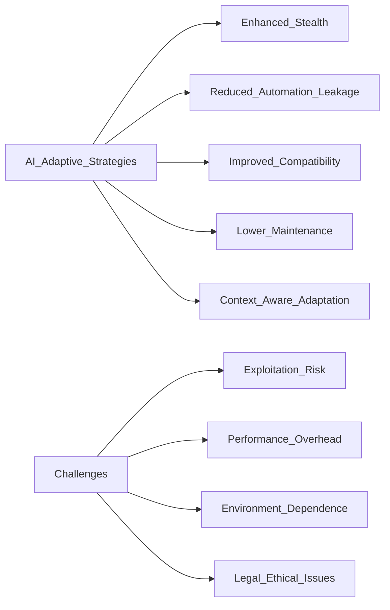
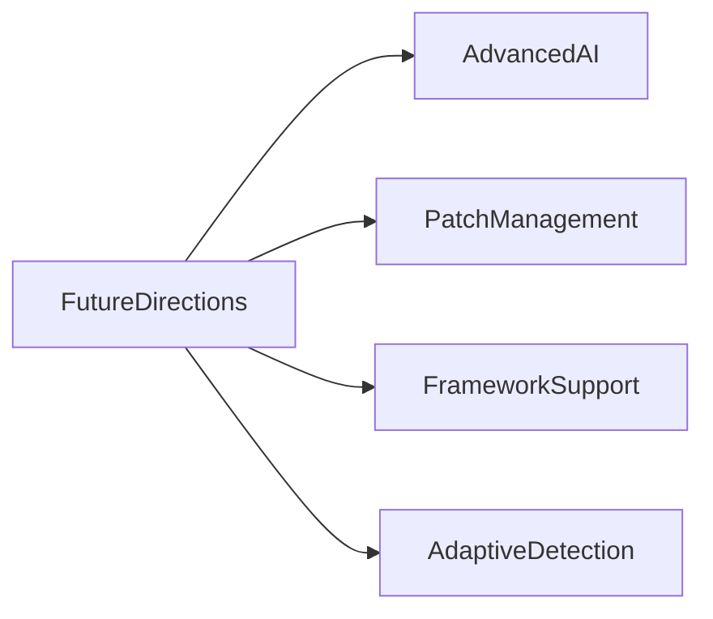

# Examining AI-Powered Stealth Techniques in the Steel Browser Repository: Technical Analysis and Future Directions

## Overview, Purpose, and Significance of the Steel Browser Repository

The Steel Browser repository is an innovative open-source project that addresses the growing challenge of anti-automation detection in modern web environments. At its core, the repository is designed to automate web interactions by modifying the internal behavior of popular browser automation libraries—such as `puppeteer-core` and `playwright-core`—so that automated sessions resemble genuine user interactions. By implementing a collection of diff patches and command-line tools, the project enables dynamic adaptation through both AI-assisted mechanisms and sophisticated patching strategies.

In today’s landscape, robust anti-bot measures from services like Cloudflare and DataDome have made it increasingly difficult to perform automated tasks without triggering detection systems. The repository’s primary mission is to “stealthify” browser automation by selectively altering methods responsible for exposing automation fingerprints, such as the `navigator.webdriver` property and execution context behaviors. This approach minimizes automation leakage and ensures that headless sessions evade standard detection measures.

Technically, the project leverages a modular structure, where components such as the CLI-based patcher, an OpenAPI-driven control interface, and integration with recording tools compose a cohesive system. These elements are complemented by conditional patch behavior, which can be dynamically controlled through environment variables (e.g., `REBROWSER_PATCHES_RUNTIME_FIX_MODE`), allowing for context-aware modifications to browser drivers. This adaptive capability makes the Steel Browser repository a compelling solution in the field of stealth automation.

The significance of this work lies in its balanced blend of AI algorithms, technical frameworks, and low-level patch management—an approach that not only improves the reliability of automated interactions but also lowers the maintenance overhead typically associated with forking and managing custom browser modules. As such, the Steel Browser repository represents a critical step forward in the evolution of secure, scalable web automation techniques, and it sets the stage for the detailed technical analysis and comparative study presented in the subsequent sections.

> **Note:** For further reading on browser automation techniques and anti-detection strategies, consult the [Puppeteer Documentation](https://pptr.dev/) and [Playwright Documentation](https://playwright.dev/).

## Technical Analysis of the Repository's Components and AI-Enabled Automation Techniques

The Steel Browser repository is architected as a modular system that integrates several distinct components to enable stealthy web automation. At its core, the project employs diff patching techniques on popular browser automation libraries—such as `puppeteer-core` and `playwright-core`—to alter internal behaviors and minimize automation footprints.

### Modular Components and Their Roles

The repository is structured into multiple interlocking modules, each contributing to adaptive web automation:

- **OpenAPI-Based Control Interface:**  
  The OpenAPI module provides a RESTful interface (with endpoints such as `/v1/scrape`, `/v1/screenshot`, and `/v1/sessions`) that allows higher-level automation systems to interact with a patched browser instance. This design abstracts the underlying complexity and enables streamlined browser session management. Further details can be found in the [OpenAPI Specification](https://swagger.io/specification/).

- **Patcher CLI and Diff Patching Mechanism:**  
  Central to the repository is the CLI-based patcher. The tool reads diff patch files—organized by target library versions—and applies them to modify critical functions (e.g., the handling of execution contexts or the `navigator.webdriver` property) that anti-automation systems rely on for detection. The CLI tool, implemented via `patcher.js` and its supportive utilities in `scripts/utils/index.js`, leverages child processes to run standard system commands. For example, the function below constructs the patching command dynamically:

  ```javascript
  export const getPatchBaseCmd = (patchFilePath) => {
    return `patch --batch -p1 --input=${patchFilePath} --verbose --no-backup-if-mismatch --reject-file=- --forward --silent`
  }
  ```

  This mechanism ensures that patches are applied deterministically, with options for dry-run checks and reversal (unpatching) functionalities.

- **Integration with Browser Automation Libraries:**  
  By targeting libraries like `puppeteer-core` and `playwright-core`, the patches adjust internal methods—such as those used in context acquisition and runtime event handling—to eliminate tell-tale automation markers. This integration is carefully versioned (e.g., patches for `puppeteer-core` 22.13.x and `playwright-core` 1.47.x) to maintain compatibility and minimize disruption to the underlying libraries.

- **Recorder Extension and Selenium Driver:**  
  The repository also incorporates a browser recorder extension (leveraging [rrweb](https://www.rrweb.io/)) which captures browser interactions for later analysis, and a Selenium driver module that supports an alternative automation backend via ChromeDriver. These elements not only broaden the functional scope of the project but also contribute to a layered approach towards evading detection.

### AI-Enabled Adaptive Automation

While the repository does not integrate full-fledged machine learning models, it implements **AI-inspired adaptive behavior** through conditional logic embedded in its patch files and environment configurations. Key environment variables include:

- **REBROWSER_PATCHES_RUNTIME_FIX_MODE:**  
  This variable governs whether certain runtime adjustments (such as bypassing `Runtime.enable` in the browser’s execution context) are activated. By toggling this setting, users can adapt the patch behavior based on real-time system characteristics—a strategy akin to adaptive learning in AI systems.

- **REBROWSER_PATCHES_UTILITY_WORLD_NAME:**  
  Overriding default naming conventions for isolated execution contexts allows the system to dynamically adjust to detection patterns and maintain stealth.

These configurable parameters enable the repository to respond to various operational environments, effectively “learning” to optimize its patch strategy without requiring heavy computational overhead. This approach is comparable to adaptive control systems seen in AI, where real-time feedback modifies system behavior.

### Inter-Component Workflow

The overall automation process can be summarized in the following workflow diagram:



This flow highlights how the CLI tool initiates patch application, which transforms the targeted browser libraries. The modified libraries then interface with a RESTful API to orchestrate browser sessions, while the Selenium driver offers alternative automation pathways.

### Summary Table of Components

| Component                    | Description                                                                          | AI/Adaptive Feature                                          |
|------------------------------|--------------------------------------------------------------------------------------|--------------------------------------------------------------|
| OpenAPI Control Interface    | REST API endpoints for session control and browser task management                   | Enables dynamic session management                           |
| Patcher CLI                  | Command-line tool for applying/unapplying diff patches                                  | Uses conditionals via environment variables for adaptation   |
| Diff Patches                 | Version-specific modifications to internal methods of browser automation libraries      | Alters execution context to mimic human-like behavior        |
| Recorder Extension           | Captures browser interactions using rrweb                                             | Provides feedback data for potential adaptive improvements   |
| Selenium Driver              | Supports Selenium-based automation via ChromeDriver                                    | Offers an alternative automation backend                     |

In conclusion, the Steel Browser repository employs a well-orchestrated combination of diff patching, conditional automation, and adaptive configuration to achieve stealthy web automation. This integrated approach not only mitigates detection by anti-automation systems but also establishes a robust framework for future enhancements in AI-enabled web automation. For further reading on browser automation methods and diff patch techniques, see the [Puppeteer Documentation](https://pptr.dev/) and [Playwright Documentation](https://playwright.dev/).

## Comparative Analysis: Steel Browser Techniques Versus Existing Web Automation Technologies

The Steel Browser repository distinguishes itself through an innovative, AI-inspired dynamic patch management mechanism that contrasts markedly with traditional web automation methods. While many existing solutions rely on maintaining static, custom forked versions of browser automation libraries, Steel Browser employs an on-demand patching approach that enhances adaptability and lowers the maintenance burden.

### Dynamic On-Demand Patching Versus Custom Forking

Traditional web automation techniques often involve embedding hard-coded stealth modifications directly within libraries or maintaining separate forked codebases. For example, plugins like the [Puppeteer Stealth Plugin](https://github.com/berstend/puppeteer-extra/tree/master/packages/puppeteer-extra-plugin-stealth) provide a fixed set of adjustments to mask automation fingerprints; however, these adaptations must be manually updated whenever the target libraries evolve. In contrast, Steel Browser’s patcher CLI tool uses a dynamic, diff patching mechanism that applies modifications on demand. This is achieved via a streamlined process that reads version-specific patch files and executes system-level patch commands. Consider the following code snippet from the project:

```javascript
export const getPatchBaseCmd = (patchFilePath) => {
  return `patch --batch -p1 --input=${patchFilePath} --verbose --no-backup-if-mismatch --reject-file=- --forward --silent`
}
```

This approach offers a clear advantage: patches can be applied or reversed without the need to maintain diverged code, ensuring that updates from upstream libraries are more easily integrated.

### AI-Inspired Adaptability

A notable innovation of the Steel Browser repository is its use of environment variables (e.g., `REBROWSER_PATCHES_RUNTIME_FIX_MODE` and `REBROWSER_PATCHES_UTILITY_WORLD_NAME`) to conditionally control patch behavior. This conditional logic allows the system to adjust its modifications in real time based on operational context—essentially mimicking adaptive learning processes observed in AI systems. Whereas traditional methods require periodic manual intervention to update stealth features against evolving detection mechanisms (such as those used by Cloudflare or DataDome), Steel Browser’s AI-inspired adaptivity provides a more resilient alternative.

### Comparative Overview of Techniques

| Feature             | Steel Browser Techniques                                                                  | Traditional/Web Automation Methods                             |
|---------------------|-------------------------------------------------------------------------------------------|----------------------------------------------------------------|
| Patching Mechanism  | Dynamic, on-demand diff patching via a CLI tool                                            | Static custom forks or hard-coded stealth plugins              |
| Adaptivity          | Conditional logic through environment variables enabling real-time behavior adjustments    | Limited adaptive capabilities; updating relies on manual intervention |
| Maintenance         | Low overhead; patches are applied and reversed without altering the core libraries         | High maintenance; managing custom forks can lead to code divergence |
| Framework Support   | Supports multiple libraries (e.g., Puppeteer, Playwright, and Selenium)                      | Often tailored to a single framework with less flexibility       |
| Flexibility         | Highly configurable and AI-inspired, encouraging real-time tuning of patch behavior          | Fixed modifications with less room for dynamic adjustment         |

### Strengths and Challenges

This comparative analysis underscores the advantages of the Steel Browser approach—namely, its simplicity, flexibility, and low-maintenance design. The ease of on-demand patch management significantly reduces the complexity associated with traditional custom forking strategies. However, reliance on system-level commands and environment-based configurations may introduce challenges in certain contexts (e.g., misconfiguration or compatibility issues on some platforms).

In summary, while many web automation solutions continue to use static, manually maintained stealth techniques, the Steel Browser repository’s dynamic and adaptive patching model presents an attractive, forward-looking alternative. Its approach not only mitigates detection more effectively but also sets the stage for further AI enhancements in web scraping and automated testing environments. For further insights, please refer to the [Puppeteer Documentation](https://pptr.dev/), [Playwright Documentation](https://playwright.dev/), and [Selenium WebDriver](https://www.selenium.dev/).

## Implications of Utilizing AI for Web Automation: Benefits and Challenges

The integration of AI-inspired strategies in web automation, as demonstrated by the Steel Browser repository, presents a dual-edged impact on modern automated systems. By leveraging adaptive patching techniques and conditional runtime behavior, the repository enhances the stealth of browser automation while simultaneously introducing new technical and ethical complexities.

### Benefits of AI-Inspired Web Automation

The primary advantages arising from AI-powered strategies in web automation include:

- **Enhanced Stealth and Reduced Leakage:**  
  AI-inspired conditional logic—controlled via environment variables (e.g., `REBROWSER_PATCHES_RUNTIME_FIX_MODE` and `REBROWSER_PATCHES_UTILITY_WORLD_NAME`)—allows the system to dynamically modify internal browser behaviors. This results in sessions that closely mimic genuine user activity and minimizes the exposure of automation fingerprints (such as the `navigator.webdriver` property). This adaptive approach is crucial for bypassing sophisticated anti-bot mechanisms employed by services like [Cloudflare](https://www.cloudflare.com) and [DataDome](https://datadome.co).

- **Improved Compatibility and Flexibility:**  
  The repository’s dynamic patching system supports multiple browser automation frameworks—including `puppeteer-core`, `playwright-core`, and even Selenium (via ChromeDriver). This broad compatibility reduces the need for maintaining separate custom forks and ensures that organizations can seamlessly switch between or combine different automation back-ends, as supported by resources like [Selenium WebDriver](https://www.selenium.dev/).

- **Lower Maintenance Overhead:**  
  Unlike traditional methods that often require static modifications and the maintenance of diverged codebases, the on-demand application and reversal of patches streamline the process. This results in more efficient management and quicker adaptation to changes in underlying libraries.

- **Adaptive and Context-Aware Behavior:**  
  Although not deploying complex machine learning models, the repository’s use of environmental configuration for runtime adjustments mimics an adaptive control mechanism. By “learning” in response to operational contexts, the system can adjust its behavior in real-time, improving the robustness of automated tasks.

### Challenges and Risks

Despite these benefits, several challenges are inherent in integrating AI-powered automation strategies:

- **Exploitation by Malicious Actors:**  
  The sophisticated evasion techniques that benefit legitimate automation tasks can also be exploited by attackers to bypass security systems. This dual-use dilemma raises concerns about the potential for AI-enhanced tools to facilitate malicious activities such as fraud, unauthorized data scraping, or bypassing bot-detection measures.

- **Performance Overhead:**  
  Incorporating additional layers of conditional checks and runtime adaptations can add performance costs. Depending on the complexity of the environment-specific configurations, such overhead might impact the efficiency of automation processes, particularly in high-frequency or large-scale operations.

- **Environment-Specific Dependencies:**  
  Reliance on environment variables and external system commands (like the Unix `patch` command) introduces platform-specific challenges. Misconfiguration or dependency mismatches can cause unintended failures or reduce the reliability of the automation.

- **Legal and Ethical Considerations:**  
  Modifying third-party libraries raises important legal and ethical questions. Compliance with licensing terms (e.g., those governing [ChromeDriver](https://sites.google.com/a/chromium.org/chromedriver/), [rrweb](https://www.rrweb.io/), and other dependencies) is critical. Moreover, ethical considerations surrounding data privacy and the potential for overstepping acceptable usage boundaries must be carefully managed.

### Summary Table of Implications

| Aspect                    | Benefit                                                          | Challenge                                                   |
|---------------------------|------------------------------------------------------------------|-------------------------------------------------------------|
| Stealth and Leakage       | Mimics human-like behavior, reducing detection risk              | Can be misused by malicious actors                          |
| Compatibility             | Supports multiple frameworks (Puppeteer, Playwright, Selenium)     | May require careful configuration to maintain reliability    |
| Maintenance               | On-demand patching reduces code divergence and update effort       | Environmental dependencies can lead to platform-specific issues |
| Adaptivity                | Dynamic, context-aware modifications enhance robustness            | Potential performance overhead with runtime conditionals     |
| Legal/Ethical Considerations | Encourages innovation while respecting license agreements         | Raises concerns about compliance and ethical usage           |

### Visual Overview



> **Note:** Balancing these benefits and challenges will be paramount as AI-enhanced automation technologies continue to evolve. Ongoing research and interdisciplinary dialogue are needed to ensure that such systems not only advance technical capabilities but also adhere to ethical norms and legal frameworks. For further insights, refer to the [Puppeteer Documentation](https://pptr.dev/), [Playwright Documentation](https://playwright.dev/), and [Selenium Official Site](https://www.selenium.dev/).

## Future Directions and Potential Innovations in AI-Driven Web Automation

Looking ahead, the proactive integration of more advanced AI techniques and a dynamic patch management strategy offers promising avenues for enhancing the capabilities of the Steel Browser repository. Building on its current strengths—such as AI-inspired adaptive behavior and robust diff patching—future research can explore several key areas:

### Advanced AI Algorithms and Predictive Models

One potential innovation is the incorporation of **advanced AI algorithms**, such as reinforcement learning and deep neural networks, to predict and adapt to emerging detection methods. By analyzing real-time browser metrics and historical patch performance, predictive models could enable dynamic adjustments to optimize stealth capabilities. This approach could help anticipate new anti-bot strategies and allow the system to preemptively adapt, thereby reducing the likelihood of detection.

### Refined Patch Management and Continuous Integration

Enhancing the patch management system is another promising direction. Future iterations might integrate automated diff generation and sophisticated feedback loops into a continuous integration/continuous deployment (CI/CD) pipeline. This would allow for:
- **Automated Update Testing:** Seamless generation and testing of new patches as target libraries evolve.
- **AI-Guided Adaptations:** Real-time analysis to determine the most effective patch adjustments.
  
Such refinements would reduce manual overhead and improve overall patch accuracy.

### Expanded Framework Compatibility and Adaptive Anomaly Detection

Expanding support beyond current favorites (like `puppeteer-core` and `playwright-core`) to include additional automation frameworks—especially those for mobile web and emerging headless environments—can broaden the repository's applicability. At the same time, integrating **adaptive anomaly detection** systems will enable real-time monitoring of browser behavior. Machine learning techniques could flag deviations from expected performance profiles and trigger dynamic patch customization to address any new vulnerabilities.

### Empirical Analysis and Benchmarking

To ensure the long-term effectiveness of these innovations, further empirical research is essential. Establishing comprehensive benchmarks to evaluate patch performance under varied operational conditions will provide data-driven insights. Such studies will guide iterative improvements in both patch design and adaptive control mechanisms, ensuring sustained stealth efficacy in the face of evolving web automation countermeasures.

### Summary Table of Innovation Areas

| Innovation Area                 | Description                                                                                          | Potential Benefits                                               |
|---------------------------------|------------------------------------------------------------------------------------------------------|------------------------------------------------------------------|
| Advanced AI Algorithms          | Integration of reinforcement learning and deep learning for predictive patch adjustments.            | Increased adaptability and proactive threat detection.         |
| Refined Patch Management        | Automated diff generation and CI/CD integration for continuous patch updates.                        | Reduced maintenance overhead and enhanced patch accuracy.        |
| Expanded Framework Compatibility| Broaden support to emerging automation frameworks, including mobile platforms and alternative browsers.| Extended usability and improved system robustness.               |
| Adaptive Anomaly Detection      | ML-driven real-time monitoring to identify and correct behavioral anomalies dynamically.             | Proactive stealth enhancement and self-optimized patch adjustments.|
| Empirical Benchmarking          | Data-driven evaluation of patch effectiveness and long-term reliability under varied conditions.      | Validated performance improvements and informed evolution of strategies.|

### Future Workflow Diagram



These forward-looking initiatives promise not only to enhance the versatility and resilience of the Steel Browser repository but also to set a new standard for AI-driven web automation research. By leveraging advanced machine learning methods, automating patch management, and broadening framework interoperability, the next generation of stealth techniques can achieve unprecedented adaptability and reliability in real-world applications.

## Conclusion: Summarizing Key Findings and Outlining Future Opportunities

In summary, the Steel Browser repository represents a significant advancement in stealth web automation. Leveraging a dynamic diff patching mechanism, the project adapts popular browser automation libraries (such as `puppeteer-core` and `playwright-core`) to mitigate detection by anti-automation systems. By modifying critical internal methods that expose automation footprints, the repository enables headless browsers to mimic genuine user interactions, thereby reducing identification risks from platforms like Cloudflare and DataDome.

Our analysis reveals several key technical insights. First, the repository’s modular architecture—spanning an OpenAPI-based control interface, a robust CLI-driven patcher, and support for both recording extensions and Selenium drivers—ensures versatility and adaptability in diverse operational contexts. Second, the integration of AI-inspired adaptive behavior through environment-controlled conditional logic (e.g., via `REBROWSER_PATCHES_RUNTIME_FIX_MODE` and `REBROWSER_PATCHES_UTILITY_WORLD_NAME`) provides a means to adjust the patching process in real time. This approach contrasts with traditional static methodologies, offering a lower maintenance overhead and enhanced flexibility.

The comparative evaluation underscores that on-demand patching not only simplifies integration with multiple frameworks but also anticipates shifts in anti-bot measures in a rapidly evolving digital landscape. Moreover, while the current techniques deliver tangible benefits in terms of stealth and adaptability, they also open up several avenues for future research and innovation.

Looking forward, potential research directions include the incorporation of advanced AI algorithms—such as reinforcement learning or deep predictive models—to proactively adjust patch strategies based on real-time analytics. Refining the patch management process through continuous integration and empirical benchmarking can further enhance reliability and performance. Additionally, expanding compatibility to cover emerging automation frameworks (including mobile platforms) and integrating adaptive anomaly detection systems will help form a robust, next-generation stealth automation platform.

Finally, while championing these technical advancements, it is essential to address the associated ethical and legal dimensions to ensure responsible use, mitigate risks of misuse, and maintain compliance with licensing agreements and privacy standards.

## References and Further Readings

Below is a curated list of sources and additional resources that provide further insights into the core topics addressed in this paper. These references cover aspects of browser automation libraries such as Puppeteer and Playwright, Selenium-driven testing, OpenAPI specifications, diff patch mechanisms, and AI-inspired automation techniques.

1. **Puppeteer Official Documentation** – Learn more about Puppeteer's APIs and usage: [https://pptr.dev/](https://pptr.dev/)
2. **Playwright Official Documentation** – Comprehensive guide to Playwright and browser automation: [https://playwright.dev/](https://playwright.dev/)
3. **Selenium WebDriver** – Official website for Selenium testing tools: [https://www.selenium.dev/](https://www.selenium.dev/)
4. **OpenAPI Specification** – Detailed documentation for REST API design: [https://swagger.io/specification/](https://swagger.io/specification/)
5. **rrweb Recorder** – Information on the rrweb library for capturing web interactions: [https://www.rrweb.io/](https://www.rrweb.io/)
6. **yargs Command-Line Parser** – GitHub repository and documentation: [https://github.com/yargs/yargs](https://github.com/yargs/yargs)
7. **Unix “patch” Command** – An overview of diff patch mechanisms: [https://en.wikipedia.org/wiki/Patch_(Unix)](https://en.wikipedia.org/wiki/Patch_(Unix))
8. **ChromeDriver** – Licensing and usage guidelines for ChromeDriver: [https://sites.google.com/a/chromium.org/chromedriver/](https://sites.google.com/a/chromium.org/chromedriver/)
9. **ICU Project** – Resource on International Components for Unicode: [https://unicode-org.github.io/icu/](https://unicode-org.github.io/icu/)
10. **Libjpeg‑Turbo** – High-performance JPEG encoding/decoding library: [https://libjpeg-turbo.org/](https://libjpeg-turbo.org/)
11. **HarfBuzz** – Open source text shaping engine documentation: [https://harfbuzz.github.io/](https://harfbuzz.github.io/)

For additional academic discussions on AI-based automation strategies and dynamic patching techniques, readers are encouraged to explore digital libraries such as [IEEE Xplore](https://ieeexplore.ieee.org/) and [ACM Digital Library](https://dl.acm.org/).