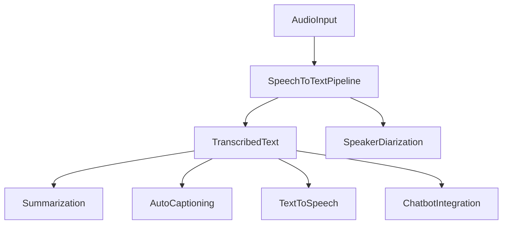
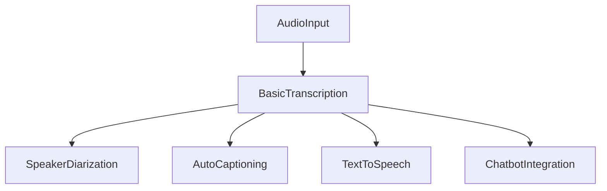

# Getting Started with WhisperPlus: A Comprehensive Step-by-Step Guide

<br />
<p align="center">
  
</p>
<br />

# Introduction

Welcome to the WhisperPlus journey! In this guide, you’ll discover how WhisperPlus transforms the renowned OpenAI Whisper model into a versatile, multi-functional tool for speech and language processing. **WhisperPlus extends the original Whisper model** by seamlessly integrating additional pipelines such as speaker diarization, auto-captioning, text summarization (for both short and long texts), text-to-speech synthesis, and innovative chatbot interactions.

Designed to cater to a variety of real-life applications, WhisperPlus can empower content creators to quickly generate transcriptions and captions for videos, help educators produce lecture summaries, and support accessibility tools by delivering real-time speech-to-text outputs. Whether you are a seasoned developer or a beginner dipping your toes into modern AI solutions, this guide offers a clear, step-by-step approach—using plain language and practical examples that demystify the underlying technology.

Throughout this tutorial, you will learn how to install the package, configure its components, and implement real-world use cases. Expect hands-on code demonstrations, easily digestible explanations, and tips for integrating powerful features like:

- **Speech-to-Text Transcription:** Convert audio files or YouTube videos into accurate text.
- **Speaker Diarization:** Automatically label different speakers within the audio.
- **Summarization & Auto-Captioning:** Generate concise summaries and overlay captions on videos.
- **Text-to-Speech & Chatbot Integrations:** Transform text back into audio and create interactive, conversational AI experiences.

> 🚀 *Get ready to unlock the full potential of state-of-the-art speech recognition and language processing with WhisperPlus!*

Let’s dive in and explore how these features can elevate your projects to the next level.

## Requirements and Prerequisites

Before diving into WhisperPlus, ensure your system meets a few essential prerequisites to guarantee a smooth experience. Below is an overview of both hardware and software requirements, along with additional recommendations for advanced features.

### Hardware Requirements

- **Processor:** A modern multi-core CPU is recommended.
- **GPU (Optional):** A CUDA-enabled GPU will markedly accelerate inference, although CPU-only usage is supported for smaller tasks.
- **Memory:** At least 8GB of RAM is advisable, especially when processing long audio or video files.

### Software Requirements

- **Python:** Version 3.7 or later (Python 3.8+ is ideal).
- **Operating System:** Linux, macOS, or Windows.
- **Core Libraries:**
  - `PyTorch` (version ≥ 2.0 for best compatibility with CUDA)
  - `HuggingFace Transformers`
  - `whisperplus` (installable via pip)
- **Media Processing Tools:**
  - `ffmpeg` – must be installed and available in your system PATH.
  - `yt_dlp` for downloading media content.
  - `moviepy` may be required for video-related tasks.

### Optional & Advanced Dependencies

- **Speaker Diarization:**  
  Install `pyannote.audio` via the provided [requirements file](requirements/speaker_diarization.txt) to enable speaker labeling features.
- **Quantization & Enhanced Inference:**  
  Optional tools such as `bitsandbytes`, `hqq`, and `flash-attn` (install with `pip install flash-attn --no-build-isolation`) can improve performance.
- **Text-to-Speech & Chatbot Integration:**  
  Additional packages and model-specific configurations (such as Suno’s Bark) are used for TTS and retrieval-augmented conversational AI features.

> ℹ️ **Tip:** Refer to the README and installation instructions for detailed commands and configuration options to set up each dependency correctly.

The table below summarizes the key dependencies:

| Feature                | Required Component                                | Installation Suggestion                                 |
|------------------------|---------------------------------------------------|---------------------------------------------------------|
| Core Transcription     | Python, PyTorch, HuggingFace Transformers         | `pip install whisperplus`                               |
| Video Auto-Captioning  | ffmpeg, yt_dlp, moviepy                           | Install via system package manager and pip as needed    |
| Speaker Diarization    | pyannote.audio                                    | `pip install -r requirements/speaker_diarization.txt`   |
| Quantization & Inference| bitsandbytes, hqq, flash-attn                      | Optional: Enhances performance; see docs for details    |
| Text-to-Speech & Chatbot| Model-specific packages (e.g., Suno’s Bark)       | Refer to pipeline documentation for exact requirements  |

By ensuring these prerequisites are met, you'll be well-equipped to unleash the full range of features offered by WhisperPlus—from basic transcription to advanced audio and language processing tasks.

## Installation and Setup

Getting started with WhisperPlus is simple and efficient. In this section, we’ll walk you through installing the core package along with additional dependencies required for advanced features such as speaker diarization, auto-captioning, and quantized inference.

### Installing WhisperPlus

You can install WhisperPlus via pip from PyPI with a single command:

```bash
pip install whisperplus
```

Alternatively, to get the latest updates directly from GitHub, run:

```bash
pip install git+https://github.com/kadirnar/whisperplus.git
```

### Installing Additional Dependencies

For a complete experience, especially if you plan to use advanced functionalities, install the following:

- **Flash Attention:**  
  This optimization accelerates inference:
  ```bash
  pip install flash-attn --no-build-isolation
  ```
- **Speaker Diarization:**  
  Enhance transcription with speaker labels by installing the required dependencies:
  ```bash
  pip install -r requirements/speaker_diarization.txt
  ```
- **Media Processing Tools:**  
  Make sure `ffmpeg`, `yt_dlp`, and (optionally) `moviepy` are installed. For example, to install the YouTube downloader:
  ```bash
  pip install yt_dlp
  ```
  If needed, refer to your operating system’s package manager for installing `ffmpeg`.

### Verifying Your Setup

After installation, verify that WhisperPlus is set up correctly. Open your terminal and run:

```bash
python -c "from whisperplus import SpeechToTextPipeline; print('Installation Successful!')"
```

### Next Steps

> ℹ️ **Tip:** Consult the README and requirements files for detailed configuration options—including API key setups and model quantization parameters—to tailor WhisperPlus to your project’s needs.

You’re now ready to explore the powerful features of WhisperPlus and start transforming speech into text with state-of-the-art accuracy!

# Getting Started with WhisperPlus: A Comprehensive Step-by-Step Guide

## Understanding the Core Components

WhisperPlus is built as a collection of interlocking pipelines that simplify advanced speech and language processing tasks. At its heart, the toolkit leverages OpenAI’s Whisper model, but it extends functionality to cover a wide range of applications—all through a modular design that lets you plug and play components as needed.

### Core Pipelines

- **Speech-to-Text Transcription:**  
  The fundamental component is the `SpeechToTextPipeline` (located in the pipelines folder). This module ingests audio (or video) files and outputs transcribed text. It supports advanced configuration options—such as adjustable chunking and configurable strides—to efficiently process long audio files. Additionally, it benefits from enhancements like flash attention for faster inference.

- **Speaker Diarization:**  
  For content where identifying who is speaking is important, the `ASRDiarizationPipeline` leverages tools like `pyannote.audio`. It aligns speaker-change segments with transcribed text, producing dialogue with speaker labels.

- **Summarization:**  
  Two summarization pipelines are available: one for short text (`TextSummarizationPipeline`) and another designed for longer transcripts (`LongTextSummarizationPipeline`). These modules use pre-trained models from HuggingFace Transformers to generate concise summaries that capture key points.

- **Auto-Captioning & Text-to-Speech:**  
  The `WhisperAutoCaptionPipeline` extracts audio from video files (using tools such as ffmpeg) and overlays captions directly. In parallel, the `TextToSpeechPipeline` converts text back into natural-sounding speech, allowing a full circle from audio to text and back again.  
 
- **Chatbot Integration:**  
  For interactive applications, chatbot modules integrate retrieval-augmented generation to answer queries based on transcribed or summarized content.

### Configuration and Performance Enhancements

WhisperPlus supports advanced configurations by integrating quantization libraries like BitsAndBytes and HQQ. These options—combined with flash attention—significantly reduce the memory footprint and accelerate inference. The modular design also means you can easily chain these pipelines, for example, transcribing audio then summarizing the text, or generating captions for a video.

### Visual Overview



By understanding these core components and their interactions, you can choose the right pipelines to build efficient, end-to-end speech and language processing applications with WhisperPlus.

## Step-by-Step Use-Case: Transcribing and Summarizing a YouTube Video

In this section, we walk through a complete workflow that demonstrates a core real-world application of WhisperPlus—transcribing a YouTube video and generating a concise summary of its content. This use-case is particularly useful for content creators looking to quickly generate captions or for educators who need to distill lengthy lectures into key bullet points.

---

### Overview

This practical example consists of three main steps:

1. **Downloading and Extracting Audio:** Use the built-in downloading utility to extract the audio track from a YouTube video.
2. **Transcription:** Convert the extracted audio into text using the `SpeechToTextPipeline`.
3. **Summarization:** Summarize the resulting transcription using a text summarization pipeline (e.g., a HuggingFace model such as Facebook’s BART).

Below is a high-level flow diagram of the process:


---

### Step 1: Downloading and Extracting Audio

WhisperPlus includes utilities to easily download YouTube videos and extract their audio. In this example, the `download_youtube_to_mp3` function retrieves the audio as an MP3 file and saves it locally.

> ℹ️ **Tip:** Ensure you have `yt_dlp` and `ffmpeg` installed before running this step.

**Code Example:**

```python
from whisperplus import download_youtube_to_mp3

# Specify the YouTube URL and output parameters
url = "https://www.youtube.com/watch?v=di3rHkEZuUw"
audio_path = download_youtube_to_mp3(url, output_dir="downloads", filename="sample_audio")

print("Audio downloaded to:", audio_path)
```

---

### Step 2: Transcribing the Audio

With the audio file downloaded, the next step is to transcribe it into text. Here, we use the `SpeechToTextPipeline`, which leverages WhisperPlus’s core transcription capabilities. In this example, we configure the model with quantization settings (via `HqqConfig`) and enable flash attention for improved inference speed.

> 🔍 **Note:** The parameters `chunk_length_s` and `stride_length_s` help manage long audio files by splitting them into manageable segments.

**Code Example:**

```python
from whisperplus import SpeechToTextPipeline
from transformers import HqqConfig

# Configure quantization settings (for improved speed and reduced memory usage)
hqq_config = HqqConfig(
    nbits=4,
    group_size=64,
    quant_zero=False,
    quant_scale=False,
    axis=0,
    offload_meta=False,
)

# Initialize the transcription pipeline
transcription_pipeline = SpeechToTextPipeline(
    model_id="distil-whisper/distil-large-v3",
    quant_config=hqq_config,
    flash_attention_2=True,
)

# Transcribe the downloaded audio file
transcript_result = transcription_pipeline(
    audio_path=audio_path,
    chunk_length_s=30,
    stride_length_s=5,
    max_new_tokens=128,
    batch_size=100,
    language="english",
    return_timestamps=False,
)

# Extract text from the result (depending on the pipeline’s output format)
transcribed_text = transcript_result if isinstance(transcript_result, str) else transcript_result.get("text", "")
print("Transcription:\n", transcribed_text)
```

---

### Step 3: Summarizing the Transcription

After obtaining the full transcription, the next step is to condense the content into a summary. WhisperPlus supports text summarization through dedicated pipelines. In this example, we use the summarization pipeline with the model identifier `facebook/bart-large-cnn` to generate a concise summary.

**Code Example:**

```python
from whisperplus.pipelines.summarization import TextSummarizationPipeline

# Initialize the summarization pipeline using a HuggingFace model
summarizer = TextSummarizationPipeline(model_id="facebook/bart-large-cnn")

# Generate a summary from the transcribed text
summary = summarizer.summarize(transcribed_text)

# Print the summary (the output is typically a list of dictionaries)
print("\nSummary:\n", summary[0]["summary_text"])
```

---

### Putting It All Together

Below is a consolidated script that performs all three steps—downloading, transcribing, and summarizing—in one go:

```python
from whisperplus import download_youtube_to_mp3, SpeechToTextPipeline
from whisperplus.pipelines.summarization import TextSummarizationPipeline
from transformers import HqqConfig

# Step 1: Download and extract audio from the YouTube video
url = "https://www.youtube.com/watch?v=di3rHkEZuUw"
audio_path = download_youtube_to_mp3(url, output_dir="downloads", filename="sample_audio")

# Step 2: Transcribe the audio to text
hqq_config = HqqConfig(
    nbits=4,
    group_size=64,
    quant_zero=False,
    quant_scale=False,
    axis=0,
    offload_meta=False,
)

transcription_pipeline = SpeechToTextPipeline(
    model_id="distil-whisper/distil-large-v3",
    quant_config=hqq_config,
    flash_attention_2=True,
)

transcript_result = transcription_pipeline(
    audio_path=audio_path,
    chunk_length_s=30,
    stride_length_s=5,
    max_new_tokens=128,
    batch_size=100,
    language="english",
    return_timestamps=False,
)

transcribed_text = transcript_result if isinstance(transcript_result, str) else transcript_result.get("text", "")
print("Transcription:\n", transcribed_text)

# Step 3: Summarize the transcribed text
summarizer = TextSummarizationPipeline(model_id="facebook/bart-large-cnn")
summary = summarizer.summarize(transcribed_text)
print("\nSummary:\n", summary[0]["summary_text"])
```

This complete workflow demonstrates how WhisperPlus can be used to automate the process of converting video content into structured, insightful text—a functionality that benefits educators, content creators, and accessibility advocates alike.

> 🚀 **Next Step:** Experiment with different parameters (such as chunk size or model configurations) to fine-tune the transcription quality and summarization style to fit your specific needs.

## Exploring Advanced Features

While the core pipelines of WhisperPlus deliver robust speech-to-text transcription, its real power emerges when you start exploring the advanced modules designed to extend functionality beyond basic transcription. In this section, we introduce several additional features that empower you to build richer, end-to-end applications. Experiment with each of these features to tailor the tool to your specific needs.

---

### Speaker Diarization

**What It Does:**  
Speaker diarization automatically distinguishes and labels different speakers within an audio file. This advanced feature is invaluable for meetings, interviews, and any multi-speaker recordings.

**When to Use It:**  
- Enhancing meeting transcriptions by identifying who is speaking.
- Creating dialogue-style transcripts for interviews or panel discussions.

**Example Code:**

```python
from whisperplus.pipelines.whisper_diarize import ASRDiarizationPipeline
from whisperplus import download_youtube_to_mp3, format_speech_to_dialogue

# Download a sample audio from YouTube
audio_path = download_youtube_to_mp3("https://www.youtube.com/watch?v=example", output_dir="downloads", filename="diarization_sample")

# Initialize the diarization pipeline with the required models
pipeline = ASRDiarizationPipeline.from_pretrained(
    asr_model="distil-whisper/distil-large-v3",
    diarizer_model="pyannote/speaker-diarization",
    use_auth_token=False,
    chunk_length_s=30,
    device="cpu"
)

# Process the audio to extract speaker-labeled segments
output = pipeline(audio_path, num_speakers=2, min_speaker=1, max_speaker=2)
dialogue = format_speech_to_dialogue(output)
print("Speaker Diarization Output:\n", dialogue)
```

> ℹ️ **Tip:** Experiment with the number of speakers (using parameters like `num_speakers`, `min_speaker`, and `max_speaker`) to tune the output for your specific audio content.

---

### Text-to-Speech Synthesis

**What It Does:**  
The text-to-speech (TTS) module converts written text into natural, high-quality speech. This is ideal for creating audio versions of your transcripts, audiobooks, or accessibility solutions.

**When to Use It:**  
- Transforming transcriptions into listenable content.
- Building voice assistants or reading aids.

**Example Code:**

```python
from whisperplus.pipelines.text2speech import TextToSpeechPipeline

# Initialize the text-to-speech pipeline with the desired model
tts = TextToSpeechPipeline(model_id="suno/bark")

# Convert a sample text into synthesized speech
audio = tts(text="Hello, welcome to WhisperPlus advanced features!", voice_preset="v2/en_speaker_6")

# The generated audio file can then be saved or played back
print("Generated audio content is ready for playback.")
```

> 🔊 **Note:** Adjust the `voice_preset` parameter to experiment with different voice styles and inflections.

---

### Auto-Captioning of Videos

**What It Does:**  
Auto-captioning automatically overlays transcribed text as subtitles on video files. This feature is perfect for improving video accessibility and enhancing content for social media.

**When to Use It:**  
- Automating caption generation for videos.
- Creating engaging content with synchronized subtitles.

**Example Code:**

```python
from whisperplus.pipelines.whisper_autocaption import WhisperAutoCaptionPipeline
from whisperplus import download_youtube_to_mp4

# Download a sample video from YouTube
video_path = download_youtube_to_mp4("https://www.youtube.com/watch?v=example", output_dir="downloads", filename="autocaption_sample")

# Initialize the auto-captioning pipeline
caption_pipeline = WhisperAutoCaptionPipeline(model_id="openai/whisper-large-v2")

# Generate a captioned video
output_video = caption_pipeline(video_path=video_path, output_path="outputs/autocaptioned_video.mp4", language="english")
print("Captioned video saved at:", output_video)
```

---

### Chatbot Integration with Retrieval-Augmented Generation

**What It Does:**  
This module integrates advanced speech recognition with conversational AI, enabling you to build chatbots that can answer questions or provide summaries based on transcribed content. Leveraging retrieval-augmented generation, the chatbot can access relevant information from transcripts to deliver insightful responses.

**When to Use It:**  
- Creating interactive customer support systems.
- Building educational assistants that answer queries from transcribed lectures.

**Example Code:**

```python
from whisperplus.pipelines.autollm_chatbot import AutoLLMChatWithVideo

# Initialize the chatbot integration with the necessary models and configuration
chatbot = AutoLLMChatWithVideo.from_pretrained(
    asr_model="distil-whisper/distil-large-v3",
    chatbot_model="openai-chat",
    vector_db_model="lancedb"
)

# Query the chatbot for a summary or specific information
query = "Can you summarize the key points of the discussion?"
response = chatbot(query)
print("Chatbot Response:", response)
```

> ⚠️ **Note:** Additional configuration (like API keys or model parameters) may be required to unlock full chatbot functionality.

---

### Visual Overview of Advanced Feature Integration

Below is a mermaid diagram that illustrates how advanced features extend the basic transcription workflow:



---

### Feature Summary

| Feature                 | Description                                                        | Use Cases                                     |
|-------------------------|--------------------------------------------------------------------|-----------------------------------------------|
| Speaker Diarization     | Labels speakers in transcripts and separates dialogue segments     | Meetings, interviews, panel discussions       |
| Text-to-Speech          | Converts text into natural audio output                            | Audiobooks, accessibility, voice assistants     |
| Auto-Captioning         | Overlays subtitles onto videos automatically                       | Content creation, video publishing, accessibility |
| Chatbot Integration     | Provides interactive, retrieval-based conversational AI            | Customer support, interactive learning tools    |

---

### Final Thoughts on Advanced Features

The modular architecture of WhisperPlus means you can mix and match these advanced features to design custom solutions for complex problems. Whether enhancing transcriptions with speaker labels, converting text back into speech, or integrating with modern AI chatbots, these functionalities not only extend the use cases of WhisperPlus but also open up new avenues for innovation.

> 🚀 **Experiment Further:**  
> Feel free to tweak code parameters, combine pipelines, or explore new integrations to fully leverage the flexibility of WhisperPlus. Your journey into advanced speech and language processing has only just begun!

Happy exploring!
